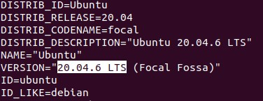
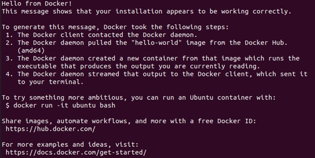
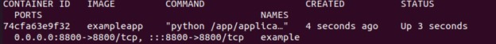
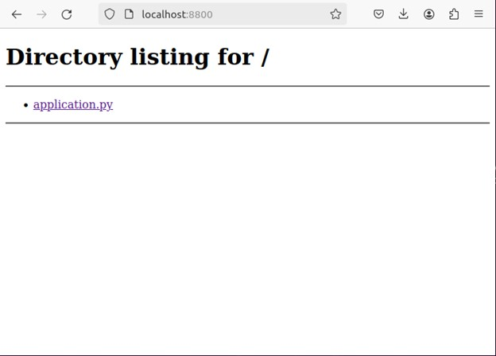

# Основы Docker. Создание образа и запуск контейнера
## Введение
Добро пожаловать в руководство по созданию образа и запуска контейнера на Docker для начинающих. Здесь мы поговорим о всех шагах, которые вас ожидают: от установки Docker до загрузки образа в сеть. С помощью руководства вы сможете создавать простые образы Docker, запускать и останавливать контейнеры, познакомитесь с основными командами Docker.

Руководство написано для пользователей ОС Ubuntu.
## Оглавление
1.	Установка Docker Engine
2.	Создание Docker-образа
3.	Запуск контейнера и основные команды Docker
4.	Загрузка образа в сеть
5.	Полезные ссылки
## Установка Docker Engine
Первым делом мы должны удостовериться, что Docker работает на установленной версии Ubuntu. Запускаем команду:

```
cat /etc/*rel*
```

Находим строчку `VERSION` и сверяемся с [сайтом](https://docs.docker.com/engine/install/ubuntu/), что она работает:




Если версия ОС устарела, то обновляем ее.

Далее мы проверяем, что на машине нет установленных версий Docker, и удаляем их:

```
for pkg in docker.io docker-doc docker-compose docker-compose-v2 podman-docker containerd runc; do sudo apt-get remove $pkg; done
```

Создаем репозиторий для установки Docker:

```
# Дабовляем официальный GPG-ключ Docker:
sudo apt-get update
sudo apt-get install ca-certificates curl
sudo install -m 0755 -d /etc/apt/keyrings
sudo curl -fsSL https://download.docker.com/linux/ubuntu/gpg -o /etc/apt/keyrings/docker.asc
sudo chmod a+r /etc/apt/keyrings/docker.asc

# Добавляем репозиторий:
echo \
  "deb [arch=$(dpkg --print-architecture) signed-by=/etc/apt/keyrings/docker.asc] https://download.docker.com/linux/ubuntu \
  $(. /etc/os-release && echo "$VERSION_CODENAME") stable" | \
  sudo tee /etc/apt/sources.list.d/docker.list > /dev/null
sudo apt-get update
```

Далее нужно установить последнюю версию Docker при помощи команды:

```
sudo apt-get install docker-ce docker-ce-cli containerd.io docker-buildx-plugin docker-compose-plugin
```

Проверяем, что установка прошла успешно. Для этого мы запустим образ `hello-world`:

```
sudo docker run hello-world
```

Если установка завершена успешно, то вы увидите следующее:



 
##  Создание Docker-образа
Для начала мы создаем директории, в которой будет храниться наш проект:

```
mkdir docker
mkdir docker/application
cd docker
```

В **docker/application/** мы будем хранить файлы для нашего образа. Создаем в ней файл `application.py`:

```
vi application/application.py
```

И записываем в него:

```python
import http.server
import socketserver
import os

PORT = 8800

# Класс SimpleHTTPRequestHandler обслуживает файлы из текущего каталога и ниже, непосредственно сопоставляя структуру каталога с запросами HTTP
Handler = http.server.SimpleHTTPRequestHandler

# Создаем и слушаем HTTP сокет, 
# отправляем запрос обработчику.
httpd = socketserver.TCPServer(("", PORT), Handler)

# Выводим текущий статус в консоль и записываем его в логи. 
# Он будет записан первой строчкой в 'docker logs'.
os.system(f"echo 'serving at port {PORT}'")

# Обрабатываем запросы, пока сервер не будет отключен.
httpd.serve_forever()
```

В директории **docker/** создаем `Dockerfile`:

```
Vi Dockerfile
```

И прописываем в нем следующие зависимости:

```
# Используем образ Python с Docker Hub

FROM python 

# Устанавливаем рабочую директорию
WORKDIR /app

# Копируем все нужные файлы в директорию, где будет собран образ
COPY ./application /app

# Открываем порт
EXPOSE 8800

# Запускаем приложение
CMD ["python3", "/app/application.py"]
```

Создаем образ при помощи команды:

```
docker build -t exampleapp -f Dockerfile .
```

`-t` используется для явного указания названия образа.

`exampleapp` – название образа, которое мы использовали.

`-f` используется для явного указания Dockerfile.

`.` – папка, в которой нужно искать Dockerfile.

Чтобы проверить, что появилась новая папка, в которой хранится наш образ, можно запустить команду:

```
ls -l
```

## Запуск контейнера и основные команды Docker
Запускаем образ при помощи команды:

```
docker run -p 8800:8800 -t -d --name example exampleapp
```

`-p` используется для установки взаимодействия порта Docker с портом компьютера.

`-t` нужен для выделения псевдотерминала, который соединяет используемый терминал с потоками `STDIN` и `STDOUT` контейнера.

`-d` запускает контейнер в фоновом режиме, чтобы он не занимал командную строку.

`--name` нужен для создания определенного имени для контейнера.

Чтобы посмотреть список контейнеров, пишем:

```
docker ps -a
```

`-a` нужен, чтобы вывести все контейнеры, в том числе остановленные.

Среди контейнеров мы должны увидеть новый на основе образа `exampleapp`:


 

Мы можем выполнить команду в нашем контейнере, например, прочитать содержимое **/etc/hosts**:

```
docker exec exampleapp cat /etc/hosts
```

Можно запустить терминал внутри нашего контейнера:

```
docker exec -it exampleapp sh
```

Для выхода из контейнера нужно ввести команду:

```
exit
```

Мы можем подключиться к нашему контейнеру в браузере, если введем в строке:

```
localhost:8800
```

Мы должны в браузере увидеть следующее:


 

Также мы можем использовать другие команды. Например, чтобы остановить контейнер, пишем:

```
docker stop <ID контейнера>
```

Чтобы удалить контейнер, используйте команду:

```
docker rm -f <ID контейнера>
```

Чтобы посмотреть все доступные на хосте образы, используем:

```
docker images
```

При помощи этой команды удаляем образы:

```
docker rmi <название образа>
```

Важно! Перед удалением образа, нужно остановить все контейнеры, которые его используют.

## Загрузка образа в сеть

Сначала нужно зарегистрироваться на [Docker Hub](https://hub.docker.com/).
Далее создаем образ, в котором в качестве названия будет использован наш логин:

```
docker build -t <логин>/<название образа>
```

Прописываем команду:

```
docker login
```

Затем вводим свой логин и пароль.
Чтобы добавить свой образ на Docker Hub, вводим:

```
docker push <логин>/<название образа>
```

## Полезные ссылки
- [Официальная документация Docker](https://docs.docker.com/)
- [Docker Hub](https://hub.docker.com/)
- [Хороший курс для новичков по Docker](https://stepik.org/course/123300/syllabus)
